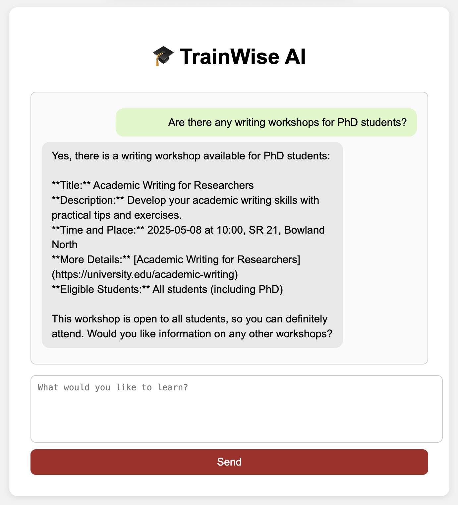
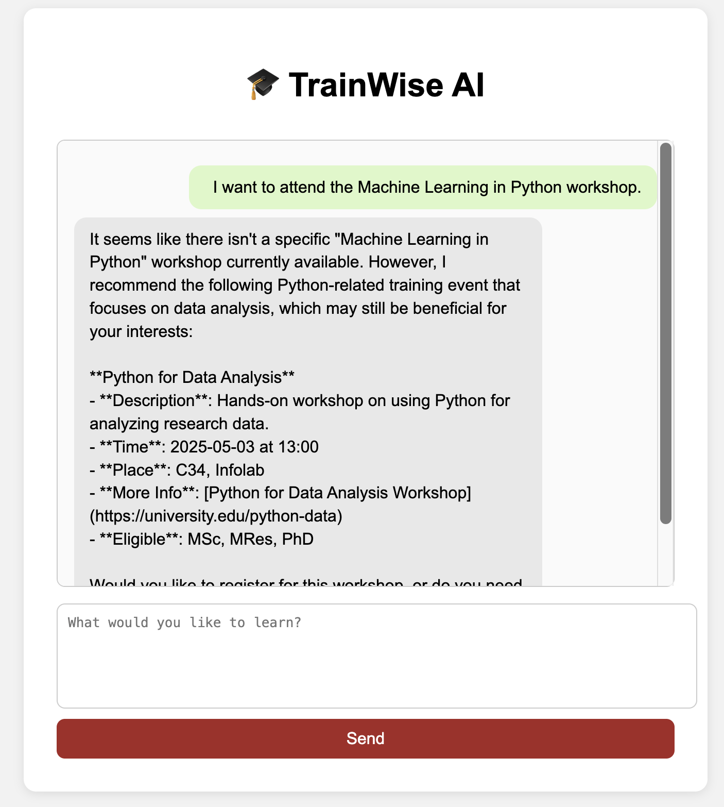
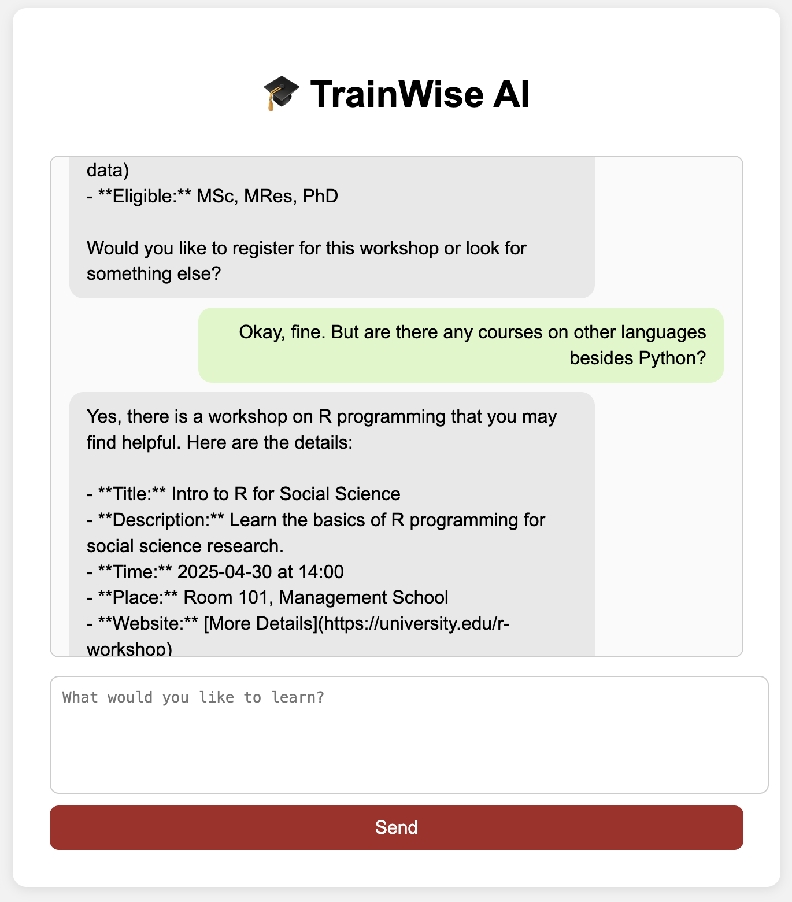

# 📚 Example User Scenarios
### Scenario 1: Offering a Relevant Recommendation
TrainWise AI responds with a detailed and relevant recommendation based on the user's academic level.

### Scenario 2: Requesting Alternatives
TrainWise AI can refine suggestions based on evolving needs. 

